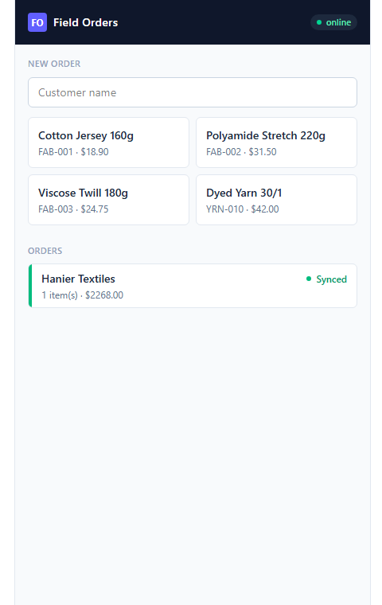

# 📦 RouteLine

**Offline order capture for food & beverage distributors and DSD route reps.**
Take the order in the cooler, not the parking lot — every order captured offline,
priced right, and on the manager's dashboard the second there's a bar of signal.

> **No signal is not the same as no sale.**

[](https://github.com/danbws/field-orders/actions/workflows/ci.yml)



## What it is / who it's for

RouteLine is an **offline-first order-taking app** for field sales reps who take
reorders where there's no signal — walk-in coolers, stockrooms, loading docks.
It's built for **small regional food & beverage distributors and DSD operations**
(craft beverage, coffee roasters, specialty foods, bakery, produce) running
**3–25 reps** who today work off paper pads, texts, and spreadsheets re-keyed into
QuickBooks.

**Status:** the offline sync engine (device-minted UUIDs + idempotent batch sync)
and **server-authoritative pricing** are done. The multi-tenant SaaS shell (auth,
orgs, roles), Stripe billing, and a real installable **PWA** (service worker +
IndexedDB, replacing the current `localStorage` demo store) are on the roadmap —
see [`docs/PRODUCT.md`](docs/PRODUCT.md).

The full product brief — positioning, ICP, pricing, brand — lives in
[`docs/PRODUCT.md`](docs/PRODUCT.md).

## How offline-first works here

The whole design reduces to one rule: **the device is the source of truth until the server
acknowledges.**

```
tap "save"                    connection returns          server acks
    │                               │                         │
    ▼                               ▼                         ▼
UUID minted on device  ──►  outbox flushed in batch  ──►  created/duplicate
(works with zero signal)    (window 'online' event)       outbox cleared
```

1. **Client-generated identity.** Each order gets a `crypto.randomUUID()` the moment the rep
   saves it — no server round-trip needed, so saving works in a basement.
2. **The outbox pattern.** Saved orders go into a local queue. The UI shows them immediately
   (`⏳ waiting for sync`), because for the rep the order *exists* — sync is plumbing.
3. **Idempotent sync.** When connectivity returns, the queue is pushed as a batch to
   `POST /api/sync`. The server answers `created`, `duplicate`, or `rejected` per order. A
   retry after a dropped connection can never double-book — `duplicate` is also success, and
   the outbox clears either way.
5. **Server-authoritative pricing.** On sync, the server prices every line from the catalog
   — it overwrites the device-sent `unit_price`/`product_name` (a rep can't fat-finger or
   discount a line) and `rejects` any order that references an unknown SKU, persisting
   nothing for it. The catalog is the source of truth.
4. **Catalog caching.** The product list is cached locally on every successful fetch, so the
   rep can keep composing orders with stale-but-useful data while offline.

The interesting failure mode this handles: the batch lands on the server but the *response*
is lost. The device still has the orders queued, retries later, and the server's idempotency
turns the replay into a no-op.

## Stack

| Layer    | Tech                                           |
|----------|------------------------------------------------|
| Frontend | React 18 · TypeScript · Vite · Tailwind CSS 4  |
| Backend  | Python 3.12 · FastAPI · SQLAlchemy 2.0         |
| Database | PostgreSQL 16 (SQLite in-memory for tests)     |
| Infra    | Docker Compose · GitHub Actions                |

## Run it

```bash
docker compose up --build
```

- App: http://localhost:5174 — open DevTools → Network → "Offline" to feel the magic
- API docs: http://localhost:8001/docs

### Tests

```bash
cd backend
pip install -r requirements.txt
pytest   # covers idempotent replay, in-batch dedup, partial batches
```

## About me

I'm Daniel Bichof — full-stack developer with 10 years building ERP and fintech systems for
industrial clients. See also [factory-flow](https://github.com/danbws/factory-flow) and
[invoice-engine](https://github.com/danbws/invoice-engine).

[LinkedIn](https://www.linkedin.com/in/danbichof) · daniel@websys.ind.br

## License

MIT
